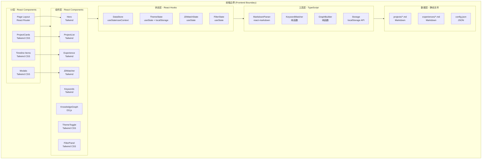
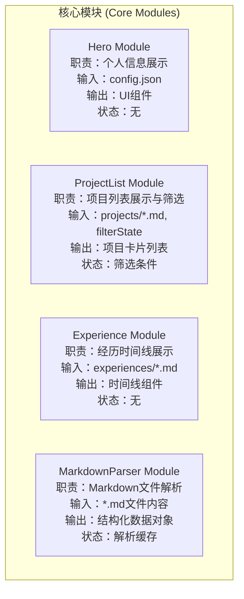
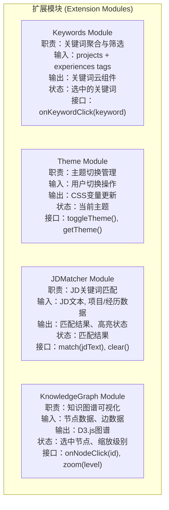
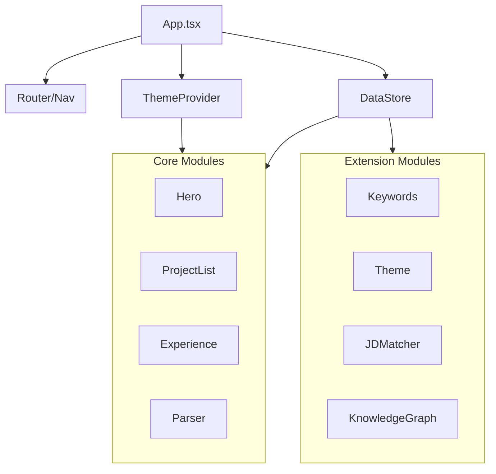
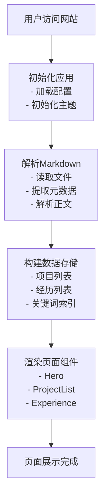
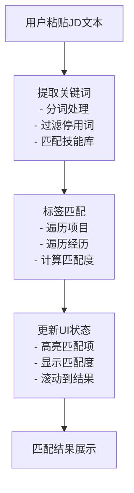
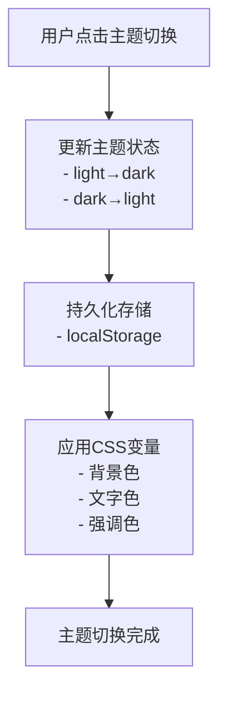
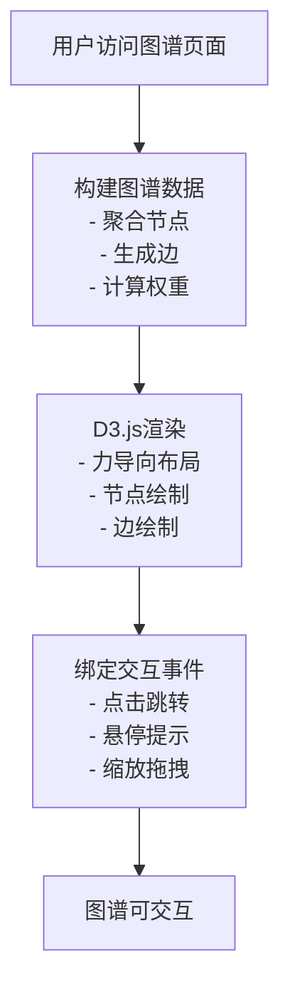

# 个人展示网页 - 技术架构设计文档

## 文档信息
| 项目 | 内容 |
|------|------|
| 版本 | v1.1 |
| 创建日期 | 2026-05-04 |
| 更新日期 | 2026-05-04 |
| 文档类型 | 技术架构设计 |

---

## 1. 架构层级设计 (Architecture Layers)

### 1.1 分层架构图（前端边界）

本项目为**纯前端项目**，无后端服务。所有功能均在前端边界内实现。



### 1.2 层级职责说明

| 层级 | 职责 | 依赖方向 |
|------|------|---------|
| **UI层** | 页面布局、视觉呈现、用户交互 | 依赖组件层 |
| **组件层** | 业务组件封装、状态消费、事件处理 | 依赖状态层 |
| **状态层** | 数据管理、状态同步、缓存控制 | 依赖解析层 |
| **解析层** | 数据格式转换、内容解析、类型校验 | 依赖数据层 |
| **数据层** | 数据存储、文件管理、配置维护 | 无依赖 |

---

## 2. 模块职责边界 (Module Responsibilities)

### 2.1 核心模块



### 2.2 扩展模块



### 2.3 模块间依赖关系



---

## 3. 数据流向设计 (Data Flow)

### 3.1 页面加载流程



### 3.2 JD匹配流程



### 3.3 主题切换流程



### 3.4 知识图谱交互流程



---

## 4. 接口设计 (Interface Design)

### 4.1 核心接口

```typescript
// ==================== 数据接口 ====================

interface Project {
  id: string;
  title: string;
  description: string;
  skillTags: string[];      // 技术标签：React, TypeScript 等
  abilityTags: string[];   // 能力标签：团队协作, 学习能力 等
  link?: string;
  image?: string;
  date: string;
  status: 'completed' | 'in-progress' | 'planned';
  content: string;
}

interface Experience {
  id: string;
  company: string;
  role: string;
  period: string;
  description: string;
  skillTags: string[];      // 技术标签：React, Node.js 等
  abilityTags: string[];   // 能力标签：团队管理, 沟通 等
  location?: string;
  content: string;
}

interface Keyword {
  name: string;
  count: number;
  type: 'skill' | 'tool' | 'domain';
}

// ==================== 状态接口 ====================

interface ThemeState {
  mode: 'light' | 'dark';
  toggle: () => void;
  setTheme: (mode: 'light' | 'dark') => void;
}

interface FilterState {
  selectedKeyword: string | null;
  setSelectedKeyword: (keyword: string | null) => void;
  clearFilter: () => void;
}

interface JDMatchState {
  jdText: string;
  matchedProjectIds: string[];
  matchedExperienceIds: string[];
  matchScore: number;
  setJDText: (text: string) => void;
  clearMatch: () => void;
}

// ==================== 组件接口 ====================

interface HeroProps {
  name: string;
  title: string;
  bio: string;
  avatar?: string;
}

interface ProjectListProps {
  projects: Project[];
  highlightedIds?: string[];
  filterKeyword?: string | null;
  onProjectClick?: (project: Project) => void;
}

interface ExperienceTimelineProps {
  experiences: Experience[];
  highlightedIds?: string[];
  filterKeyword?: string | null;
}

interface KeywordsCloudProps {
  keywords: Keyword[];
  selectedKeyword: string | null;
  onKeywordClick: (keyword: string) => void;
}

interface JDMatcherProps {
  onMatch: (result: JDMatchResult) => void;
  onClear: () => void;
}

interface KnowledgeGraphProps {
  nodes: GraphNode[];
  edges: GraphEdge[];
  onNodeClick: (node: GraphNode) => void;
}

// ==================== 图谱数据接口 ====================

interface GraphNode {
  id: string;
  label: string;
  type: 'skill' | 'project' | 'experience';
  weight: number;
}

interface GraphEdge {
  source: string;
  target: string;
  weight: number;
}

interface JDMatchResult {
  keywords: string[];
  matchedProjects: string[];
  matchedExperiences: string[];
  matchScore: number;
}
```

### 4.2 Hook接口

```typescript
// ==================== 自定义Hooks ====================

interface UseThemeReturn {
  theme: 'light' | 'dark';
  toggleTheme: () => void;
  setTheme: (theme: 'light' | 'dark') => void;
}

interface UseMarkdownReturn {
  data: Project[] | Experience[];
  loading: boolean;
  error: Error | null;
  refetch: () => void;
}

interface UseJDMatchReturn {
  match: (jdText: string) => JDMatchResult;
  clear: () => void;
  result: JDMatchResult | null;
  isMatching: boolean;
}

interface UseFilterReturn {
  selectedKeyword: string | null;
  setSelectedKeyword: (keyword: string | null) => void;
  filteredProjects: Project[];
  filteredExperiences: Experience[];
  clearFilter: () => void;
}
```

---

## 5. 文件结构设计 (File Structure)

```
project-self-introduction-v1/
├── src/
│   ├── components/                    # 组件目录
│   │   ├── core/                      # 核心组件
│   │   │   ├── Hero/
│   │   │   │   ├── Hero.tsx
│   │   │   │   ├── Hero.styles.ts
│   │   │   │   └── index.ts
│   │   │   ├── ProjectList/
│   │   │   │   ├── ProjectList.tsx
│   │   │   │   ├── ProjectCard.tsx
│   │   │   │   ├── ProjectList.styles.ts
│   │   │   │   └── index.ts
│   │   │   └── Experience/
│   │   │       ├── ExperienceTimeline.tsx
│   │   │       ├── TimelineItem.tsx
│   │   │       ├── Experience.styles.ts
│   │   │       └── index.ts
│   │   │
│   │   ├── extensions/                # 扩展组件
│   │   │   ├── Keywords/
│   │   │   │   ├── KeywordsCloud.tsx
│   │   │   │   ├── KeywordTag.tsx
│   │   │   │   ├── Keywords.styles.ts
│   │   │   │   └── index.ts
│   │   │   ├── Theme/
│   │   │   │   ├── ThemeToggle.tsx
│   │   │   │   ├── ThemeProvider.tsx
│   │   │   │   ├── Theme.styles.ts
│   │   │   │   └── index.ts
│   │   │   ├── JDMatcher/
│   │   │   │   ├── JDMatcher.tsx
│   │   │   │   ├── JDInput.tsx
│   │   │   │   ├── MatchResult.tsx
│   │   │   │   ├── JDMatcher.styles.ts
│   │   │   │   └── index.ts
│   │   │   └── KnowledgeGraph/
│   │   │       ├── KnowledgeGraph.tsx
│   │   │       ├── GraphCanvas.tsx
│   │   │       ├── NodeTooltip.tsx
│   │   │       ├── KnowledgeGraph.styles.ts
│   │   │       └── index.ts
│   │   │
│   │   └── common/                    # 通用组件
│   │       ├── Layout/
│   │       ├── Button/
│   │       ├── Card/
│   │       └── Modal/
│   │
│   ├── hooks/                         # 自定义Hooks
│   │   ├── useTheme.ts
│   │   ├── useMarkdown.ts
│   │   ├── useJDMatch.ts
│   │   ├── useFilter.ts
│   │   └── useGraph.ts
│   │
│   ├── utils/                         # 工具函数
│   │   ├── markdownParser.ts          # Markdown解析
│   │   ├── keywordMatcher.ts          # 关键词匹配
│   │   ├── graphBuilder.ts            # 图谱数据构建
│   │   └── storage.ts                 # 本地存储
│   │
│   ├── types/                         # 类型定义
│   │   ├── project.ts
│   │   ├── experience.ts
│   │   ├── theme.ts
│   │   ├── graph.ts
│   │   └── index.ts
│   │
│   ├── data/                          # 数据文件
│   │   ├── projects/                  # 项目Markdown
│   │   │   ├── project-001.md
│   │   │   └── project-002.md
│   │   ├── experiences/               # 经历Markdown
│   │   │   ├── exp-001.md
│   │   │   └── exp-002.md
│   │   └── config.json                # 站点配置
│   │
│   ├── styles/                        # 全局样式
│   │   ├── themes.css                 # 主题变量
│   │   ├── globals.css                # 全局样式
│   │   └── variables.css              # CSS变量
│   │
│   ├── pages/                         # 页面组件
│   │   ├── Home.tsx                   # 首页
│   │   ├── Graph.tsx                  # 知识图谱页
│   │   └── NotFound.tsx               # 404页面
│   │
│   ├── App.tsx                        # 应用入口
│   └── main.tsx                       # 渲染入口
│
├── public/                            # 静态资源
│   ├── images/
│   └── favicon.ico
│
├── package.json
├── tsconfig.json
├── vite.config.ts
└── tailwind.config.js
```

---

## 6. 开发阶段规划 (Development Phases)

### Phase 1: MVP核心 (Week 1-2)

| 任务 | 交付物 | 验收标准 |
|------|--------|---------|
| 项目初始化 | Vite + React + Tailwind配置 | 项目可运行 |
| Markdown解析 | 解析工具函数 | 正确解析Front Matter |
| Hero组件 | Hero.tsx | 显示个人信息 |
| ProjectList组件 | ProjectList.tsx | 卡片列表展示 |
| Experience组件 | ExperienceTimeline.tsx | 时间线展示 |
| 响应式布局 | 全局样式 | 移动端适配 |

### Phase 2: 扩展模块 (Week 3-4)

| 任务 | 交付物 | 验收标准 |
|------|--------|---------|
| 关键词模块 | KeywordsCloud.tsx | 标签聚合展示 |
| 主题模块 | ThemeProvider.tsx | 明暗切换 |
| JD匹配模块 | JDMatcher.tsx | 关键词匹配 |
| 知识图谱模块 | KnowledgeGraph.tsx | D3.js图谱 |

### Phase 3: 优化与部署 (Week 4)

| 任务 | 交付物 | 验收标准 |
|------|--------|---------|
| 性能优化 | 代码分割、懒加载 | 首屏<2s |
| 测试 | 单元测试 | 覆盖率>70% |
| 部署 | Vercel配置 | 线上可访问 |

---

## 7. 风险与缓解 (Risks & Mitigation)

| 风险 | 可能性 | 影响 | 缓解措施 |
|------|--------|------|---------|
| Markdown解析性能 | 低 | 中 | 使用缓存、按需加载 |
| D3.js学习曲线 | 中 | 中 | 参考成熟案例、逐步实现 |
| 主题切换样式冲突 | 低 | 中 | 使用CSS变量统一管理 |
| 移动端适配复杂 | 中 | 高 | 采用Tailwind响应式类 |

---

## 附录：技术栈确认

| 类别 | 技术选型 | 版本 |
|------|---------|------|
| 框架 | React | 18.x |
| 构建工具 | Vite | 5.x |
| 样式 | Tailwind CSS | 3.x |
| 图表 | D3.js | 7.x |
| Markdown解析 | react-markdown | 9.x |
| 路由 | React Router | 6.x |
| 部署 | Vercel | - |
